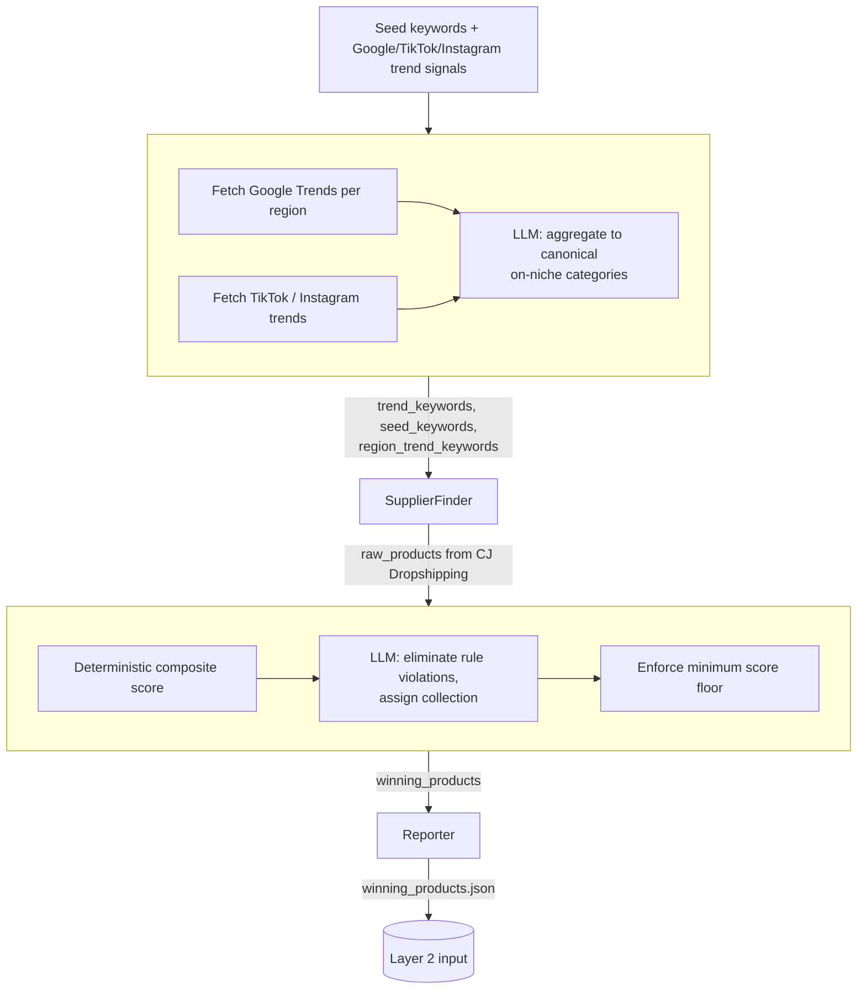
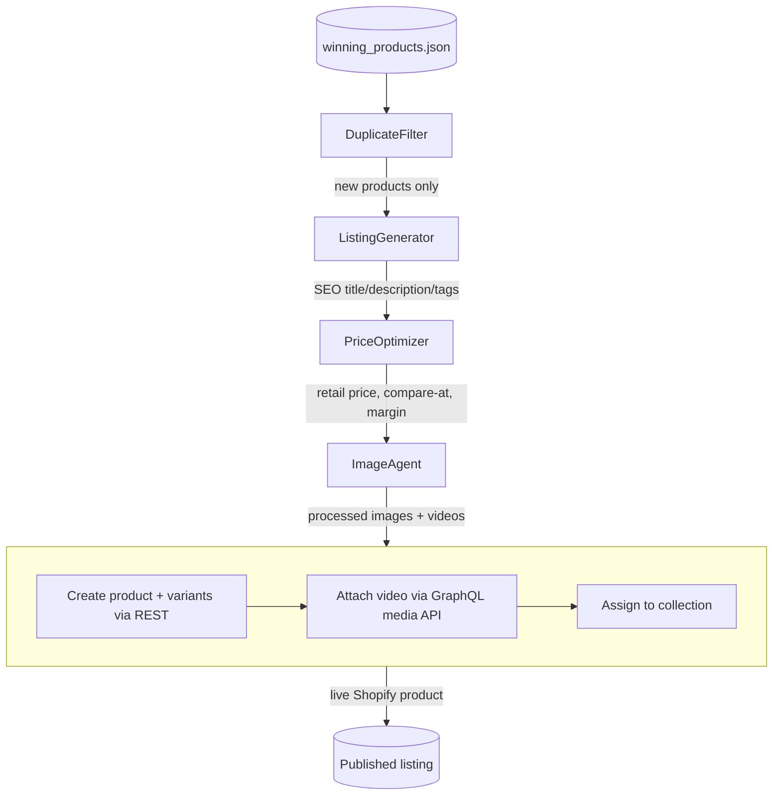
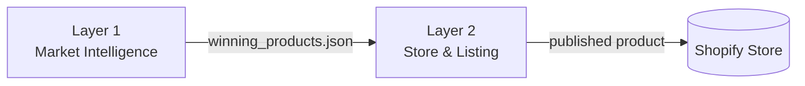

# Aurelle Dropshipping Intelligence & Publishing Pipeline

An agentic, LangGraph-orchestrated system that discovers trending dropshipping
products and autonomously turns them into fully priced, SEO-written, published
Shopify listings — with no human step between trend discovery and a live
product page.

> **Scope note:** This repository contains the two layers of a five-layer
> production system that are safe to share publicly. Layers 3–5 (order
> fulfillment/webhooks, AI-driven customer service, and dynamic pricing &
> analytics) were built for the same client but remain private, since they
> touch live order and customer data. What's here — market intelligence and
> store publishing — is complete, independently runnable, and representative
> of the system's engineering as a whole.
>
> Brand names, store URLs, and product data below are placeholders
> (`Aurelle`) or illustrative examples; no real client data is included.

---

## Overview

Dropshipping stores live or die on two things: knowing what to sell before it
saturates, and getting it listed well and fast. Doing both by hand doesn't
scale past a handful of SKUs a week. This project automates the full loop:

1. **Layer 1 — Market Intelligence**: surfaces trending, on-niche products by
   combining multi-platform trend signals (Google Trends, TikTok, Instagram)
   with live supplier data (CJ Dropshipping), then scores and filters them
   down to a shortlist worth selling.
2. **Layer 2 — Store & Listing**: takes that shortlist and produces
   Shopify-ready listings — SEO copy, pricing, processed media, variants —
   and publishes them, live, with no manual intervention.

Both layers are built as [LangGraph](https://www.langchain.com/langgraph)
state machines, run standalone or back-to-back, and are designed to run
unattended on a schedule in production (see [Deployment](#deployment--production-operations)).

## Key Capabilities

- **Multi-source trend discovery** — Google Trends, TikTok, and Instagram
  trend signals (via Apify actors), merged and normalized into clean,
  on-niche product categories by an LLM aggregation step
- **Regional trend discovery** — the same pipeline runs per-region (US,
  Europe, Korea, Japan, Latin America, Africa by default, fully configurable)
  to surface geography-specific trends, not just a single global feed
- **Live supplier sourcing** — CJ Dropshipping search with a dual-sort
  strategy (proven sellers by order count, plus new arrivals) so the catalog
  doesn't ossify around the same bestsellers
- **Deterministic + LLM hybrid scoring** — a weighted, code-computed
  composite score (trend strength, margin, order volume, shipping time,
  rating) combined with an LLM pass that handles judgment calls — niche fit,
  brand-safety, collection assignment — that don't reduce to a formula
- **Tiered, psychology-aware pricing** — cost-tiered markup plus `.99`-style
  charm pricing, with an optional competitor-price check
- **Automated SEO listing generation** — title, HTML description, bullet
  points, tags, and meta description per product
- **Full Shopify publishing** — image upload, video attachment via the
  GraphQL Admin API, automatic variant/option derivation from unstructured
  supplier data, and collection assignment
- **Cross-run deduplication** at both the discovery stage (seen-product
  cache) and the publishing stage (a TTL'd, Shopify-verified registry)
- **Runs unattended in production** as a scheduled, persistent, single-worker
  web service

## Architecture

### Layer 1 — Market Intelligence



### Layer 2 — Store & Listing


> **Production evidence:** The architecture described above has been exercised through real production runs. See [Production Validation](docs/Production Validation/production-validation.md) for sanitized execution evidence, observed runtimes, and failure-handling examples.
### End-to-end handoff



## Agent Architecture

| Node | Layer | Type | Purpose |
|---|---|---|---|
| **TrendScout** | 1 | LLM + tools | Pulls Google Trends / TikTok / Instagram signals, normalizes them into canonical on-niche product categories, globally and per region |
| **SupplierFinder** | 1 | Tools (deterministic) | Searches CJ Dropshipping for each trend/seed keyword, deduplicates against prior runs, applies niche/brand-safety blocklists |
| **Scorer** | 1 | Deterministic + LLM | Computes a weighted composite score per product, then uses an LLM to eliminate rule-violating products and assign each survivor to a collection/sub-collection |
| **Reporter** | 1 | Deterministic | Writes the final ranked shortlist to `winning_products.json`, the sole contract with Layer 2, and prints a run summary |
| **DuplicateFilter** | 2 | Deterministic | Skips products already live on Shopify (registry + live verification) before any LLM or API cost is spent |
| **ListingGenerator** | 2 | LLM | Generates SEO title, HTML description, bullet points, tags, and meta description per product |
| **PriceOptimizer** | 2 | Deterministic | Computes retail price, compare-at price, and margin from cost-tiered rules and optional competitor pricing — intentionally no LLM involved |
| **ImageAgent** | 2 | Tools (deterministic) | Downloads product images and resolved videos to local disk for the publish step |
| **StorePublisher** | 2 | Deterministic + LLM (narrow) | Publishes the product to Shopify: images, variants/options, an LLM call *only* to name ambiguous variant option columns, video attachment, and collection assignment |

Full purpose/input/output/failure-mode detail for each node lives in
[`docs/agents.md`](docs/agents.md).

## Technical Workflow

A production run looks like this:

1. A scheduler (`scheduler.py`) checks whether the current product batch is
   exhausted or a refresh interval has elapsed.
2. If due, it runs **Layer 1** end-to-end, producing a fresh
   `winning_products.json`.
3. **Layer 2** is then run against a configurable slice of that batch
   (`products_per_publish_run`) on its own cadence
   (`publish_frequency_hours`), so publishing is paced rather than dumping
   the whole batch at once.
4. Both layers persist their own dedup state (`seen_pids.json`,
   `published_pids.json`) so repeated runs never rediscover or republish the
   same product.
5. In production, this runs as a single-worker web service
   (`server.py`) with a background scheduler thread, a health check, and an
   admin-token-gated manual trigger endpoint — see
   [Deployment](#deployment--production-operations).

## Technology Stack

- **Orchestration**: [LangGraph](https://www.langchain.com/langgraph)
  (`StateGraph`) for both pipelines
- **LLM**: GPT-4o-mini via `langchain-openai`, used for trend normalization,
  product elimination/categorization, SEO copywriting, and narrow
  variant-naming decisions
- **Trend data**: Google Trends, TikTok, and Instagram, all via Apify actors
  (not direct/unofficial scraping)
- **Supplier data**: CJ Dropshipping REST API
- **Storefront**: Shopify Admin REST API (products, collections) and
  GraphQL Admin API (video media, which REST cannot handle)
- **Data modeling**: Pydantic models for both layers' state
- **Deployment**: Flask + Gunicorn, deployable to Railway or Render, backed
  by a persistent volume for cross-restart state

## Project Structure

```
.
├── README.md
├── requirements.txt
├── .env.example
├── .gitignore
├── config.json                  # all tunable parameters (no secrets)
├── config_loader.py
├── scheduler.py                 # batch/cadence-based orchestration
├── server.py                    # production web-service wrapper
├── railway.toml
│
├── layer1/                      # Market Intelligence
│   ├── pipeline.py
│   ├── state.py
│   ├── agents/
│   │   └── nodes.py              # TrendScout, SupplierFinder, Scorer
│   └── tools/
│       ├── apify_trends.py       # Google Trends + TikTok + Instagram
│       └── cj_api.py             # CJ Dropshipping client
│
├── layer2/                      # Store & Listing
│   ├── pipeline.py
│   ├── state.py
│   └── agents/
│       ├── listing_generator.py
│       ├── price_optimizer.py
│       ├── image_agent.py
│       └── store_publisher.py
│
├── docs/                         # architecture deep-dives (see below)
└── tests/                        # unit tests (mocked external APIs)
```

## Installation

```bash
git clone <this-repo>
cd aurelle-dropship-pipeline
python -m venv .venv && source .venv/bin/activate
pip install -r requirements.txt
cp .env.example .env
# fill in .env with your own API keys — see Configuration below
```

## Configuration

Two layers of configuration, deliberately kept separate:

- **`.env`** — secrets only (API keys, tokens, store URL). Never committed.
- **`config.json`** — everything else: niches, trend/product caps, region
  definitions, scoring is fixed in code but pricing bands and publish cadence
  are here. Safe to commit; contains no credentials.

Required API keys (see `.env.example` for the full list with comments):
OpenAI, CJ Dropshipping, Apify, and Shopify. A SerpAPI key is optional
(enables competitor-price checks in `PriceOptimizer`; silently skipped if
unset).

## Running Layer 1

```bash
python -m layer1.pipeline
```

Reads its settings from `config.json`'s `layer1` section by default. Writes
`layer1/output/winning_products.json` on completion.

## Running Layer 2

```bash
# Process a specific Layer 1 output file:
python -m layer2.pipeline layer1/output/winning_products.json

# Or run both layers back-to-back:
python -m layer2.pipeline
```
## Running scheduler
```
python scheduler.py --loop 
```

## Example Workflow

A single product's path through the system, illustratively:

1. TrendScout surfaces `"mini backpack"` as a rising category (aggregated
   from a TikTok hashtag, an Instagram related-tag, and a branded Google
   query all pointing at the same underlying product type).
2. SupplierFinder finds a matching CJ Dropshipping listing, passes the
   niche/brand-safety checks, and is tagged `source: trend`.
3. Scorer computes a composite score from its trend strength, margin,
   order count, shipping time, and rating, then the LLM step assigns it to
   the `Accessories → Bags` collection.
4. It clears the minimum quality bar and is written to
   `winning_products.json`.
5. DuplicateFilter confirms it isn't already live. ListingGenerator writes
   an SEO title/description/tags. PriceOptimizer sets a charm-priced retail
   value from the supplier cost. ImageAgent downloads its photos.
   StorePublisher creates the Shopify product, assigns it to the
   `Accessories` collection, and it goes live.

## Engineering Decisions

A few choices worth calling out explicitly, since they reflect real
production lessons rather than textbook defaults:

- **LLM proposes, code disposes.** Every LLM step that could introduce an
  off-niche, brand-unsafe, or men's-marketed product is backed by a
  deterministic blocklist that runs both *before* the LLM sees the data and
  *after* it responds — an instruction to an LLM is a strong signal, not a
  guarantee, and the pipeline is built around that assumption throughout.
- **A quality floor lives in code, not in the prompt.** The Scorer's LLM
  step only eliminates rule violations; it doesn't enforce a positive
  quality bar. A minimum composite-score threshold is applied afterward, in
  code, so no batch composition or LLM error path can let a low-quality
  product through.
- **Tiered pricing multipliers, not a flat margin.** A flat markup badly
  underprices cheap items, since fixed per-order costs don't scale down
  with price — CJ's tiered multiplier (higher % on cheap items) is
  preserved as the pricing basis, with a flat-margin formula only as a
  fallback when no supplier-suggested price is available.
- **Timeout-aware retry on product creation.** The Shopify product-creation
  call only retries on a connection that never succeeded — never on a
  read-timeout after the request was sent, since Shopify may have already
  created the product server-side, and a blind retry there risks a
  duplicate.
- **Variant options are classified by content, not position.** Supplier
  variant strings (e.g. `"Badge Blue-S"`) are split into option columns
  only when most variants in a batch split consistently, and each column is
  labeled by what it actually contains (color words, size patterns, pack
  counts) rather than assuming a fixed field order — an LLM only steps in
  to name a column when the heuristic can't confidently label it, and even
  then it only assigns a name, never touches the underlying values.

## Production Validation

The system has been validated through real production runs of Layers 1 and 2.

Production validation covers:

- Multi-region trend collection and caching
- LLM-based trend filtering and normalization
- Supplier discovery through external APIs
- Retry and rate-limit handling
- Graceful handling of unavailable providers
- Non-fatal handling of malformed LLM responses
- Persistent generation of `winning_products.json`
- Layer 1 → Layer 2 handoff

### Observed Production Runs

Real production runs recorded Layer 1 execution times in the ~20–22 minute range.

| Run | Duration | Result |
|---|---:|---|
| 2026-09-11 | ~21m 15s | Completed |
| 2026-09-12 | ~20m 42s | Completed |
| 2026-09-13 | ~21m 23s | Completed |
| 2026-09-14 | ~21m 21s | Completed |

These are operational observations from production logs, not controlled performance benchmarks.

### Failure Handling Observed in Production

The production logs also captured real external-service and LLM failures, including:

- HTTP 429 rate limiting from a supplier API
- Temporary/unavailable external API access
- Missing supplier results
- Malformed LLM JSON responses
- Stale or missing trend caches

The pipeline was designed to handle these conditions without crashing the complete run.

See:

- [`docs/production-validation.md`](docs/Production Validation/production-validation.md)
- [`docs/examples/sanitized-production-run.log`](docs/examples/sanitized-production-run.log)

## Production Deployment Evidence

The Layer 2 publishing pipeline has been exercised in a deployed production
environment.

The following sanitized deployment-log excerpt shows real execution activity,
including scheduled runs, duplicate filtering, SEO listing generation, and
product publishing.


The screenshot has been sanitized to remove deployment URLs, repository
identifiers, and potentially private product information.

## Reliability / Error Handling

- Every node accumulates non-fatal errors into a shared `errors` list
  rather than raising and killing the run — a single product's or
  keyword's failure doesn't stop the batch.
- Network calls to CJ Dropshipping and Shopify use pooled, retrying HTTP
  sessions with backoff, distinguishing transient network errors from
  HTTP 429/5xx (which honor a `Retry-After` header when present).
- The trend-aggregation LLM call has its own retry-with-backoff, and falls
  back to a non-LLM keyword-cleanup path if the LLM is unavailable after
  retries, so a rate-limited or degraded OpenAI account doesn't zero out
  the whole trend feed.
- Publishing deduplication is three-layered: a fast local registry check,
  a TTL on how long a product stays "protected," and live verification
  against Shopify itself — so manually deleted products get correctly
  republished instead of silently skipped forever.

## Security

- All credentials live in environment variables only; `config.json`
  contains no secrets and is safe to commit.
- The production `/trigger` endpoint requires a matching admin token header.
- This repository intentionally excludes runtime data (trend caches, seen-
  product registries, real supplier/product data) and the private Layers
  3–5 of the underlying system.

## Limitations

Documented honestly, as this is a real system, not a polished demo:

- No automated test suite currently ships in this repository (planned —
  see below); the system has been validated through real production runs.
- LLM responses are parsed by stripping Markdown code fences and calling
  `json.loads`, rather than using function-calling/structured-output mode —
  works reliably in practice but is a coarser contract than it could be.
- Several thresholds (the 60%-consistency rule for variant-option
  splitting, the minimum composite score, the batch size for LLM scoring
  calls) were tuned empirically against real supplier data rather than
  derived analytically.
- The production deployment is explicitly single-worker (documented in
  `server.py`/`railway.toml`) — scaling out would require moving the
  scheduler loop to its own process.

## Future Improvements

Kept separate from what's actually implemented above:

- Migrate LLM calls to structured outputs / function calling to remove the
  fence-stripping parse step entirely.
- Add an automated test suite with mocked CJ/Shopify/OpenAI responses
  (state validation, scoring, pricing, and dedup logic are all pure
  functions well-suited to this).
- Add observability (structured logging, run metrics) beyond console
  output.
- Replace empirically-tuned thresholds with values derived from a labeled
  evaluation set.

## Author

**MAD** — AI / NLP / LLM Engineer

*(This project was built for a real client; the two layers shown here are
shared publicly with the client's scope boundary respected — see the scope
note at the top of this README.)*
