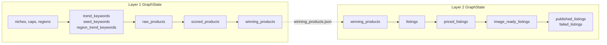

# Architecture

## System-level view

The system is two independent LangGraph pipelines connected by a single
file-based contract:

```
Layer 1 (Market Intelligence)  →  winning_products.json  →  Layer 2 (Store & Listing)
```

Each pipeline is a `StateGraph` with a linear chain of nodes (no branching or
loops within a single run — control flow like retries and batching happens
*inside* nodes, not via graph edges). This is a deliberate simplicity choice:
the problem this system solves is a pipeline, not a dynamic agent making
open-ended decisions about what to do next, so a linear graph is the
right-sized tool. See [LangGraph design rationale](#why-a-stateful-graph)
below.

## Why two separate layers instead of one graph

Layer 1 and Layer 2 have different failure domains, run on
different cadences in production, and have no need to share in-memory state —
their only coupling is `winning_products.json`. Splitting them means:

- Layer 1 can run and refresh the product shortlist on its own schedule
  (e.g. daily) without needing Layer 2's Shopify/pricing dependencies to be
  healthy.
- Layer 2 can process a paced slice of the shortlist across multiple
  scheduler ticks without re-running discovery each time.
- Either layer can be tested, run, and reasoned about independently.

## Why a stateful graph

The alternative to LangGraph here would be a plain function-call chain
(`trend_scout() → supplier_finder() → scorer() → ...`). The reasons a
`StateGraph` earns its place instead:

- **A single typed state object threads through every node.** Both
  `GraphState` (Layer 1) and Layer 2's `GraphState` are TypedDicts that
  accumulate fields as they pass through the graph (raw products → scored
  products → winning products, or listings → priced listings → image-ready
  listings → published listings). LangGraph enforces that every node reads
  and returns a consistent shape, rather than each function inventing its
  own return type that the next function has to know about.
- **Errors are data, not exceptions.** Every node appends to a shared
  `errors: List[str]` field rather than raising and unwinding the whole run.
  That pattern is much more natural to express and enforce when the state is
  a first-class object flowing through a declared graph than when it's
  implicit in nested try/excepts across a call chain.
- **Nodes are independently testable units with a declared contract** (a
  `GraphState` in, a partial `GraphState` out) — which is what makes the
  mocked-API unit tests in `tests/` possible without spinning up the whole
  pipeline.

## State flow diagram



For per-layer detail, see [`layer1.md`](layer1.md) and [`layer2.md`](layer2.md).
For per-node detail (inputs/outputs/failure modes), see [`agents.md`](agents.md).
